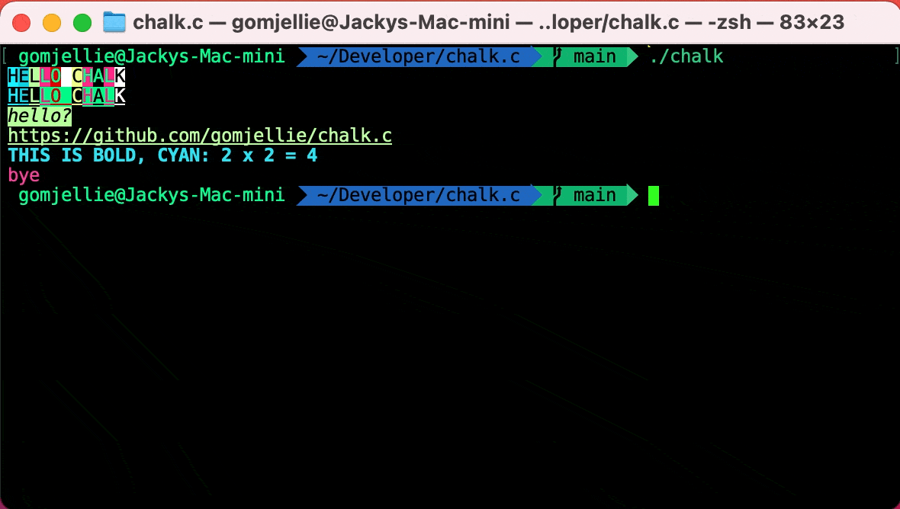

# chalk.c
🌈 Colorful Console C MACRO library



## Features

Easy Install

  - ALL YOU NEED TO DO IS COPY AND PASTE [chalk.h](./chalk.h) FILE.

Fast Performance

  - Code doesn't executed in runtime, it will be preprocessed

Flexible Expressions

  - String Literal in C lets you write flexible expressions with CHALK

## Examples

```c
#include "chalk.h"

printf(CHALK_RED("Hello World"));
       ^ ~ colors "Hello World" to RED

printf(CHALK_BG_BLUE("Hello"));
       ^ ~ colors string "Hello" background color to blue

printf(CHALK_BG_BLUE(CHALK_RED("mixed usage")));
                     ^ ~~ character color red
        ^ ~~ background color blue

printf(CHALK_BLINK("blink"));
       ^ ~~ wrap string blink effect

```

```c
#define CHALK_NO_PREFIX
        ^ ~~ this will allow you omit CHALK_ prefix
        ^ ~~ for example, RED instead of CHALK_RED
#include "chalk.h"

printf(BG_BLACK(MAGENTA("BLACK")) " " BG_MAGENTA(BLACK("PINK")));

printf(BOLD("굵은 글씨") " " DIM("연한 글씨") "\n");

printf(ITALIC("ITALIC " BOLD("ITALIC AND BOLD")));

```

```c
/* template 만들기 */
const char *int_template = MAGENTA("%d") "\n";
printf(int_template, 15);
  ~~> prints magenta colored "15"

const char *n_times_m = BLUE("%d X %d") " = " BG_CYAN("%d");
printf(n_times_m, 5, 6, 30);
  ~~> 5 X 6 blue
        ~~> = 
          ~~> 30 CYAN Background

```

## MACRO Functions

## color

|MACRO Function |
|---------------|
|CHALK_BLACK    |
|CHALK_RED      |
|CHALK_GREEN    |
|CHALK_YELLOW   |
|CHALK_BLUE     |
|CHALK_MAGENTA  |
|CHALK_CYAN     |
|CHALK_WHITE    |

|MACRO Function     |
|-------------------|
|CHALK_LIGHT_BLACK  |
|CHALK_LIGHT_RED    |
|CHALK_LIGHT_GREEN  |
|CHALK_LIGHT_YELLOW |
|CHALK_LIGHT_BLUE   |
|CHALK_LIGHT_MAGENTA|
|CHALK_LIGHT_CYAN   |
|CHALK_LIGHT_WHITE  |

## Background color

|MACRO Function  |
|----------------|
|CHALK_BG_BLACK  |
|CHALK_BG_RED    |
|CHALK_BG_GREEN  |
|CHALK_BG_YELLOW |
|CHALK_BG_BLUE   |
|CHALK_BG_MAGENTA|
|CHALK_BG_CYAN   |
|CHALK_BG_WHITE  |

| MACRO Function       |
|----------------------|
|CHALK_BG_LIGHT_BLACK  |
|CHALK_BG_LIGHT_RED    |
|CHALK_BG_LIGHT_GREEN  |
|CHALK_BG_LIGHT_YELLOW |
|CHALK_BG_LIGHT_BLUE   |
|CHALK_BG_LIGHT_MAGENTA|
|CHALK_BG_LIGHT_CYAN   |
|CHALK_BG_LIGHT_WHITE  |

## miscellaneous

| MACRO Function|
|---------------|
|CHALK_BOLD     |
|CHALK_DIM      |
|CHALK_ITALIC   |
|CHALK_UNDERLINE|
|CHALK_BLINK    |
|CHALK_STRIKE   |
|CHALK_INVERSE  |
|CHALK_HIDE     |

## References

Named it after [javascript chalk](https://github.com/chalk/chalk)
