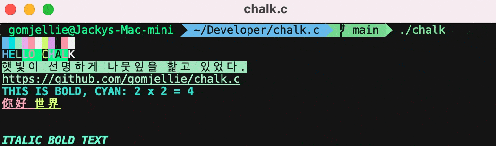

# chalk.c
colorful terminal C Macro library

## ansi color table

https://github.com/shiena/ansicolor/blob/master/README.md

https://en.wikipedia.org/wiki/ANSI_escape_code#SGR_parameters

https://tforgione.fr/posts/ansi-escape-codes/

